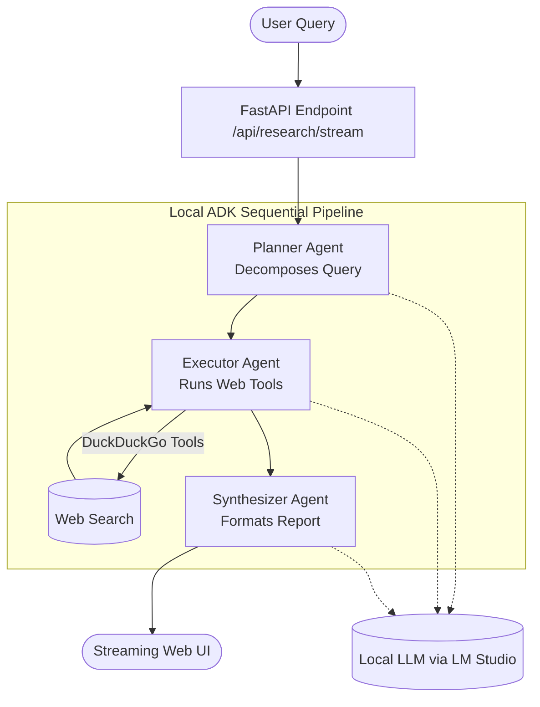

# Building the Future of Local AI: Introducing Local ADK

*How to orchestrate production-ready multi-agent workflows locally using LM Studio and FastAPI.*

---

If you’ve been tracking the breakneck pace of AI development over the past year, you’ve probably noticed two major trends: the rapid improvement of open-weight models (like Llama 3 and Mistral) and the shift from single-prompt chatbots to complex **multi-agent systems**. 

However, running multi-agent workflows often means dealing with expensive API calls, cloud vendor lock-in, and privacy concerns. What if you could build, orchestrate, and visualize a team of specialized AI agents entirely on your local machine?

Enter **Local ADK** (Agent Development Kit)—an open-source framework designed to seamlessly interface with local LLM providers like [LM Studio](https://lmstudio.ai/) and [LiteLLM](https://docs.litellm.ai/docs/), while giving you a modern, production-ready environment to build powerful AI applications.

---

## 🏗️ Architecture & Multi-Agent Flow

To handle complex tasks autonomously, Local ADK implements a multi-agent orchestration architecture. Single agents are great for answering questions, but complex tasks require specialization. 

Here is a high-level view of how the Deep Research Pipeline operates within the Local ADK server:



### 1. The Planner Agent
When you submit a complex query, the Planner acts as the project manager. It breaks down the ambiguous prompt into actionable, sequential research steps.

### 2. The Executor Agent
Armed with built-in web search tools (leveraging DuckDuckGo and `BeautifulSoup` for robust parsing), the Executor browses the web, extracts relevant data, and gathers evidence.

### 3. The Synthesizer Agent
Finally, the Synthesizer takes the raw evidence and compiles it into a comprehensive, well-structured markdown report.

---

## ⚙️ Configuration on the Go

Unlike complicated enterprise wrappers, Local ADK prioritizes a simple, straightforward setup tailored for running inference right from your GPU.

Here's a peek at how simple the core configuration handles environment mapping for the local model endpoint:

```python
# config.py
import os
from dataclasses import dataclass

@dataclass
class AppConfig:
    # Points to your local LM Studio server
    llm_base_url: str = os.getenv("OPENAI_API_BASE", "http://localhost:1234/v1")
    llm_api_key: str = os.getenv("OPENAI_API_KEY", "lm-studio")
    model_name: str = os.getenv("MODEL_NAME", "openai/google/gemma-4-e4b")

    def __post_init__(self):
        # Set environment variables dynamically for LiteLLM wrapper
        os.environ["OPENAI_API_BASE"] = self.llm_base_url
        os.environ["OPENAI_API_KEY"] = self.llm_api_key

config = AppConfig()
```

By default, it listens to the standard LM Studio local API `localhost:1234/v1`, but it easily adapts if you are using other local servers like `Ollama` or a `vLLM` instance.

---

## 🛠 Building the Pipeline

Defining the actual multi-agent system is handled using the core `SequentialAgent` structure provided by the framework. Let’s look at how the entire research pipeline is initialized:

```python
# research_agents.py
from google.adk.agents import SequentialAgent
from local_adk.agents import create_planner_agent, create_executor_agent, create_synthesizer_agent

def create_research_pipeline() -> SequentialAgent:
    """
    Creates the full 3-agent deep research pipeline:
    PlannerAgent → ExecutorAgent → SynthesizerAgent
    """
    return SequentialAgent(
        name="DeepResearchPipeline",
        description="A pipeline that plans searches, executes them, and synthesizes a report.",
        sub_agents=[
            create_planner_agent(),
            create_executor_agent(),
            create_synthesizer_agent(),
        ],
    )
```

Each of these agents is packed with its own distinct system instructions and attached toolsets (like web scraping for the Executor). Once combined in the `SequentialAgent`, they automatically pass context down the chain.

---

## 🖥 Quick Setup & Running Locally

Ready to get the system running? Since the application uses FastAPI and Poetry, booting up the entire multi-agent ecosystem is incredibly straightforward.

### Prerequisites
- Python 3.10+
- [Poetry](https://python-poetry.org/)
- A running instance of LM Studio serving a model on port `1234`.

### 1. Install Dependencies
Navigate into your project folder and let Poetry handle the rest:

```bash
poetry install
```

### 2. Start the Server
You can start the FastAPI application by executing the module. This will spool up the UI and the asynchronous streaming API endpoints:

```bash
poetry run python -m local_adk.server
```

*(Alternatively, you can run it directly via Uvicorn):*
```bash
poetry run uvicorn local_adk.server:app --host 0.0.0.0 --port 8000 --reload
```

Boom. Navigate to `http://127.0.0.1:8000` in your browser. You'll be greeted by a sleek web interface where you can submit research tasks, watch the pipeline stages activate, and read the final synthesized report—all powered entirely by your local setup.

---

## 🔮 What’s Next?

The shift towards local, sovereign AI is just getting started. Frameworks like Local ADK empower developers to build complex, autonomous applications without sacrificing privacy or paying per-token fees. 

Whether you want to build a local coding assistant, a financial research bot, or just experiment with multi-agent orchestration, the groundwork is already laid out. Let me know what local agents you end up building in the comments below!
